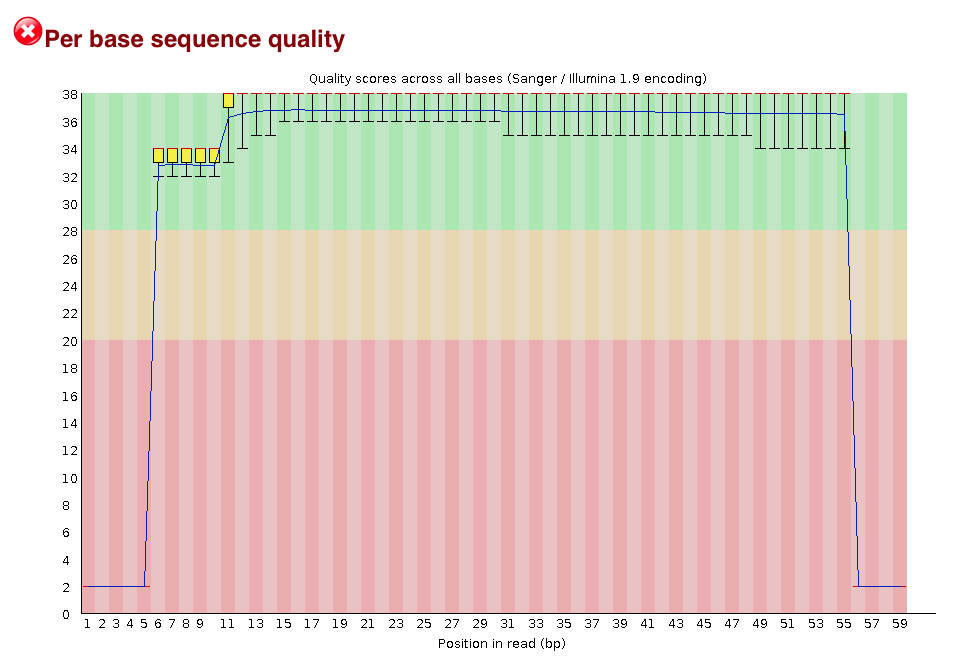
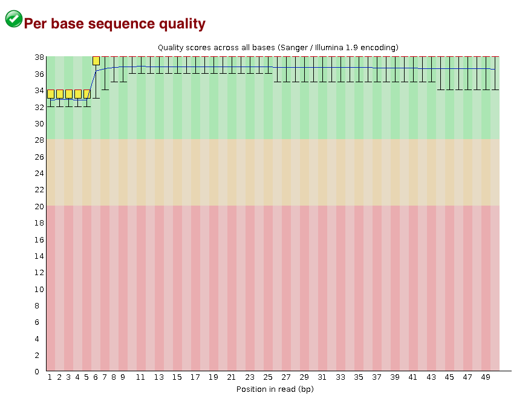
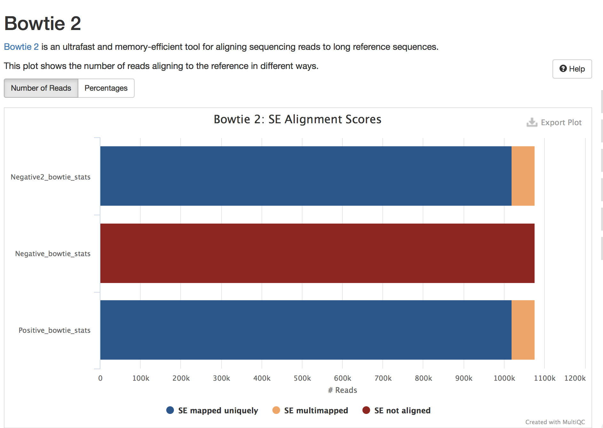
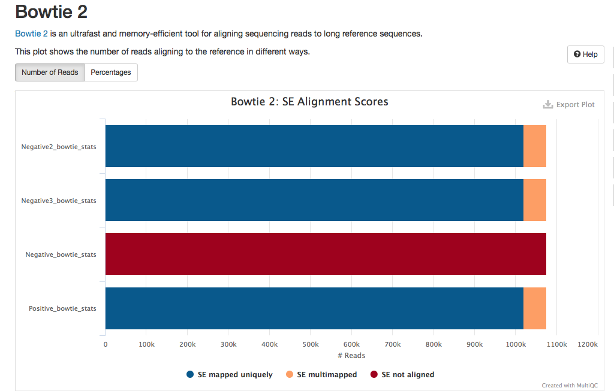
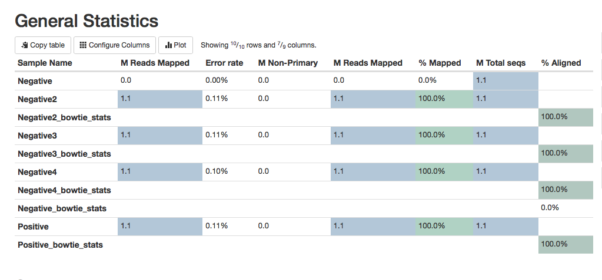
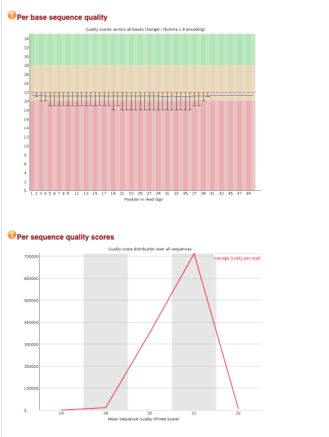
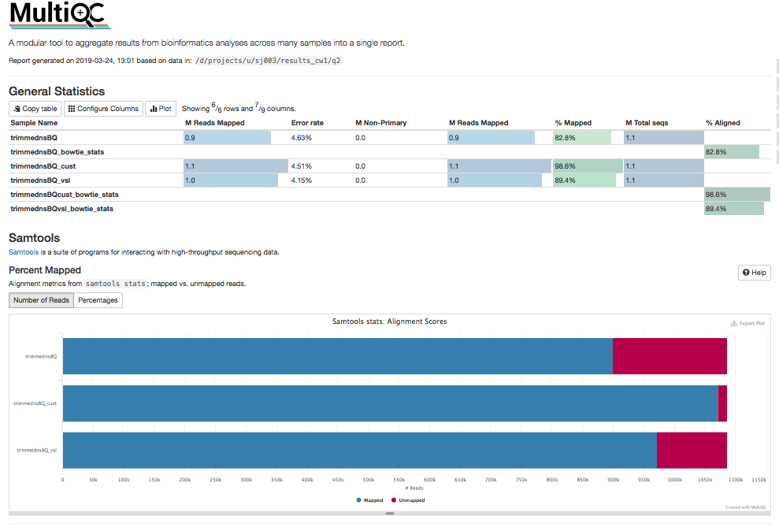

j.j.stiens@gmail.com

[github.com/jenjane118/ngs_tutorials](https://github.com/jenjane118/ngs_tutorials)

## Question 1

*Using good NGS practices, remap Negative.fq so that the mapping statistics improve.* 

*a) View file and work out what is wrong with reads. Generate fastqc report.*

First I will generate a Fastqc report of the trimmed_Negative.fq sequence file.

```bash
/s/software/fastqc/v0.11.8/FastQC/fastqc trimmed_Negative.fq

```
<!--  -->

\
{width=75%}
\

[fastqc report original](/d/projects/u/sj003/course_materials/fastq/coursework_1/trimmed_Negative_fastqc.html)

This shows very low sequence quality at the start and end of each read. Looking at the fasta file on the shell screen, it is obvious that the reads have 5 N's at the 5' end and 4 N's at the 3' end of each read that need to be removed. To do this, we use cutadapt to process each read.


```bash
/s/software/anaconda/python3/bin/cutadapt --trim-n -o trimmedNs_negative.fq trimmed_Negative.fq
less trimmedNs_negative.fq

```

Running Fastqc again, you can see an improvement in the sequence quality.


```bash
/s/software/fastqc/v0.11.8/FastQC/fastqc trimmedNs_Negative.fq
```

\
{ width=75%}
\


[fastqc report trimmed](/d/projects/u/sj003/course_materials/fastq/coursework_1/trimmedNs_Negative_fastqc.html)

*b) Use bowtie2 to align the reads to reference genome using two different options.*

To align both the original file and the trimmed file using bowtie2 against the reference genome, AFPN02.1, and generate a .sam file to use for further analysis:


```bash
time /s/software/anaconda/python3/bin/bowtie2 --end-to-end -x ${st_path}/course_materials/genomes/AFPN02.1/AFPN02.1_merge -q ${st_path}/course_materials/fastq/trimmed_Negative.fq -S Negative.sam 2> Negative_bowtie_stats.txt
```

```bash
time /s/software/anaconda/python3/bin/bowtie2 --end-to-end -x ${st_path}/course_materials/genomes/AFPN02.1/AFPN02.1_merge -q ${st_path}/course_materials/fastq/trimmedNs_Negative.fq -S Negative2.sam 2> Negative2_bowtie_stats.txt
```

The text file can be examined on the bash terminal, and the .sam file can be analysed in a multiqc display showing that the new Negative alignment (Negative2) has the same stats as Positive:


```bash
/s/software/anaconda/python3/bin/multiqc . -f
```


\
{ width=75% }
\


Another option is to align the Negative file using options in Bowtie2 that ignore the first and last bases when aligning:


```bash
time /s/software/anaconda/python3/bin/bowtie2 --end-to-end --trim5 5 --trim3 4 -x ${st_path}/course_materials/genomes/AFPN02.1/AFPN02.1_merge -q ${st_path}/course_materials/fastq/trimmed_Negative.fq -S Negative3.sam 2> Negative3_bowtie_stats.txt
```


\
{width=75%}
\

This gives the same alignment results as using cutadapt.

I can also try a local alignment on the file where I cut the Ns off to see if this improves the alignment:


```bash
time /s/software/anaconda/python3/bin/bowtie2 --local -x ${st_path}/course_materials/genomes/AFPN02.1/AFPN02.1_merge -q ${st_path}/course_materials/fastq/trimmedNs_Negative.fq -S Negative4.sam 2> Negative4_bowtie_stats.txt
```

c) samtools stats:

Negative.sam      original

Negative2.sam     trimmed Ns with cutadapt

Negative3.sam     aligned with trimming Ns with bowtie

Negative4.sam     local alignment

In order to save time running samtools for each file, I wrote a bash script (d/projects/u/sj003/results_cw1/samtools_bash.sh)


```bash
#!/bin/bash
# samtools_bash.sh
# script to run basic samtools functions for each file in folder:

# Assign everything ending in .sam to SAMFILES variable
SAMFILES=*.sam

# Loop over SAMFILES and run samtools for each file
for file in $SAMFILES
do
  filename=$(basename "$file")
  extension="${filename##*.}"
  filename="${filename%.*}"
  
  echo "Sort file:        $file"
  echo "Index file:       $filename.bam"
  echo "Create stats for file:        $file"
  echo "Create flagstat for file:       $file"

  #Call samtools functions for each file
  /s/software/samtools/v1.9/bin/samtools sort ${file} > ${filename}.bam
  /s/software/samtools/v1.9/bin/samtools index ${filename}.bam
  /s/software/samtools/v1.9/bin/samtools stats ${file} > ${filename}_stats.txt
  /s/software/samtools/v1.9/bin/samtools flagstat ${file} > ${filename}_flagstat.txt

  echo -e "######################\n\n"
done

```


Call the script using:

```bash
bash samtools_bash.sh

```

Run a MultiQC report to summarise the sequence and alignment data for all the alignments.


```bash
/s/software/anaconda/python3/bin/multiqc . -n q1_multiqc_report
```


\

\

[multiq report](/d/projects/u/sj003/results_cw1/q1_multiqc_report.html)

The report shows that the best quality alignment is for the local alignment of the sequences that had the 5' and 3' N's cut off using cutadapt (Negative4). This alignment had a slightly better error rate (0.10%) than the Positive alignment (which was done using the end-to-end alignmnent), or the edited Negative sequence using the end-to-end alignment. The local alignment allows some of the bases on the ends to be omitted to get a better alignment score. It basically just skips a base at the beginning or end if it doesn't align, and that may account for the very slightly better error rater. All 1.1M reads were mapped. I think it is a better idea to edit the N's out of the sequence reads at the outset, using cutadapt, rather than to just ignore them using the settings in bowtie2. This way the fastqc reports will accurately represent the overall sequence quality and the sequence reads can be used in other software applications without further adjustment.


##Question 2

*Use cutadapt to re-process the BQ.fq file and bowtie2 to map reads to reference genome. Discuss trade-off between improved mapping rate and error rate. Which is more important considering goal of coming up with most accurate genomic reference sequence for sampled bacterium?*

The first step is to examine the fasta file for the BQ sequence reads. Similar to Negative sequences above, they contain 5' and 3' Ns that need to be trimmed before alignment can occur. Using cutadapt, this can be accomplished the same way as we did in question 1:


```bash
/s/software/anaconda/python3/bin/cutadapt --trim-n -o trimmedns_BQ.fq trimmed_BQ.fq
less trimmedNs_negative.fq
```

We can examine the fastqc report of the edited sequence:


```bash
/s/software/fastqc/v0.11.8/FastQC/fastqc trimmedns_BQ.fq
```
\
{ width=75% }
\


This shows that though the quality of the ends is no longer as poor, the entire sequence has rather low sequence quality, with an average Phred score of 21.

Looking at the alignment of BQ with the bacterial genome reference sequence, we can see the mapping statistics are rather poor at an overall alignment rate of 82.82%:


```bash
time /s/software/anaconda/python3/bin/bowtie2 --end-to-end -x ${st_path}/course_materials/genomes/AFPN02.1/AFPN02.1_merge -q ${st_path}/course_materials/fastq/trimmedns_BQ.fq -S trimmednsBQ.sam 2> trimmednsBQ_bowtie_stats.txt
less trimmednsBQ_bowtie_stats.txt
```

I also performed bowtie2 alignment with the 'very sensitive local' setting to increase the alignment sensitivity and hopefully reduce the error rate (using local alignment) at the same time, which brings the overall alignment rate up to 89.43%.


```bash
time /s/software/anaconda/python3/bin/bowtie2 --very-sensitive-local -x ${st_path}/course_materials/genomes/AFPN02.1/AFPN02.1_merge -q ${st_path}/course_materials/fastq/trimmedns_BQ.fq -S trimmednsBQ_vsl.sam 2> trimmednsBQvsl_bowtie_stats.txt
less trimmednsBQvsl_bowtie_stats.txt
```

The 'very sensitive' setting has preset parameters that are designed to maximise sensitivity and accuracy. However, you can manually adjust these parameters, for example changing the the number of mismatches permitted per 'seed' in the alignment (using -N). I tried changing this parameter to 0, but using the same settings for the rest of the parameters as the very-sensitive-local setting uses (-D 20 -R 3 -N 1 -L 20 -i S,1,0.50). This increases the overall alignment rate to 98.64% but at what cost to the error rate?


```bash
time /s/software/anaconda/python3/bin/bowtie2 --local -D 20 -R 3 -N 1 -L 20 -i S,1,0.50 -x ${st_path}/course_materials/genomes/AFPN02.1/AFPN02.1_merge -q ${st_path}/course_materials/fastq/trimmedns_BQ.fq -S trimmednsBQ_cust.sam 2> trimmednsBQcust_bowtie_stats.txt
less trimmednsBQcust_bowtie_stats.txt
```

To evaluate the statistics for the alignments, I will call the samtools script to run the samtools functions for these files.


```bash
bash samtools_bash.sh

```

Run a MultiQC report to summarise the sequence and alignment data for all the alignments.


```bash
/s/software/anaconda/python3/bin/multiqc . -f -n q2_multiqc_report
```


\

\

[multiqc report](/d/projects/u/sj003/results_cw1/q2_multiqc_report.html)

Sequence         | MReads mapped/%    | Error Rate
-----------------|--------------------|------------
trimmednsBQ      |   0.9 / 82.8%      |   4.63%
trimmednsBQ_vsl  |   1.0 / 89.4%      |   4.15%
trimmednsBQ_cust |   1.1 / 98.6%      |   4.51%

The report shows that there is a trade-off between alignment rate and error rate. To achieve the best alignment percentage, we have to accept an error rate of 4.51% using the custom parameters (trimmednsBQ_cust). The next best alignment rate, using the very sensitive local parameters (trimmednsBQ_vsl) has a lower error rate of 4.15%. While this is better, I am not sure if any error rate above 4% is acceptable for a consensus genome. Perhaps the sequencing runs should be repeated to try to get more high quality sequences.


##Question 3

*Split the BQ aligned files into SAM files containing subsets of the full set of aligned reads.*

*Split into:*

*a) one file containing multimapping reads and another file with only uniquely mapped reads*


```bash
# for uniquely mapped reads (with MAPQ < 10); all other files in multiBQ file (-U)
/s/software/samtools/v1.9/bin/samtools view -bq 10 trimmednsBQ.bam > uniqueBQ.bam -U multiBQ.bam
```


*b) one file with unmapped reads and one with only mapped reads*


```bash
# includes unique reads (removes unmapped reads with flag of [4])
/s/software/samtools/v1.9/bin/samtools view -bF 4 trimmednsBQ.bam > mappedBQ.bam

# includes only unmapped reads (with flag [4])
/s/software/samtools/v1.9/bin/samtools view -bf 4 trimmednsBQ.bam > unmappedBQ.bam
```


*c) How can output from b be obtained using Bowtie2 instead?*

Using bowtie2 -k option allows us to report the sequences with the desired number of alignments, which in this case I am using 1 to get reads that have only matched once. Unfortunately, this leaves the unaligned sequences in the file. Looking for solutions online, it seems there was a different command in bowtie (versus bowtie2), -m, that was able to filter by number of hits. Looking online, all the advice seems to be that the most logical thing is to do this using the flags in samtools, like I've done in b.


```bash
## filters for only unique reads (-k) but still contains unaligned seqs
time /s/software/anaconda/python3/bin/bowtie2 --end-to-end -k 1 -x ${st_path}/course_materials/genomes/AFPN02.1/AFPN02.1_merge -q ${st_path}/course_materials/fastq/trimmedns_BQ.fq -S trimmednsBQ2.sam 2> trimmednsBQ2_stats.txt

```


*d) Use BLAST to identify origin of unmapped reads.*
To do this, I used samtools fasta function to convert from a .bam file to a fasta file.

```bash
/s/software/samtools/v1.9/bin/samtools fasta unmappedBQ.bam > unmappedBQ.fa
```
Then I cut and pasted 10 sequences from the fasta file into blastn window and searched on the nr/nt nucleotide database to evaluate the origin of the sequences. For 9 of the sequences Homo sapiens was the top hit, and for one of them, Pan troglodytes was the top hit (chimpanzee). I am assuming there was some contamination of the e coli sample by human DNA during purification or library construction. None of these 10 were e coli sequences.

[blastn website](https://blast.ncbi.nlm.nih.gov)

\
{width=75%}
\


