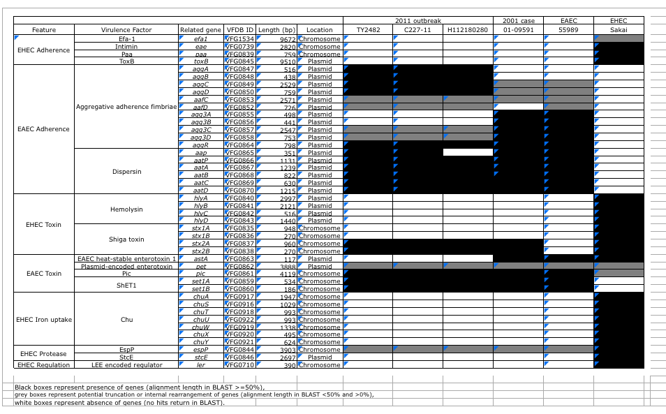
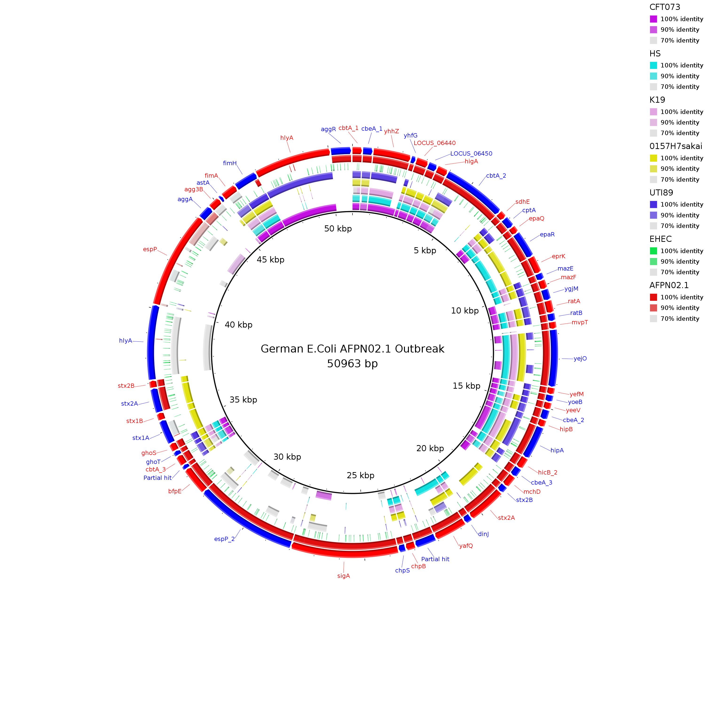
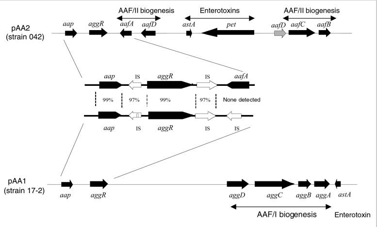
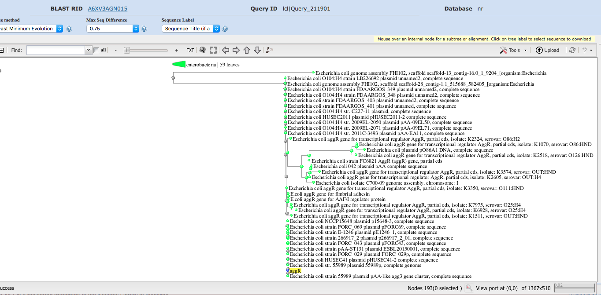
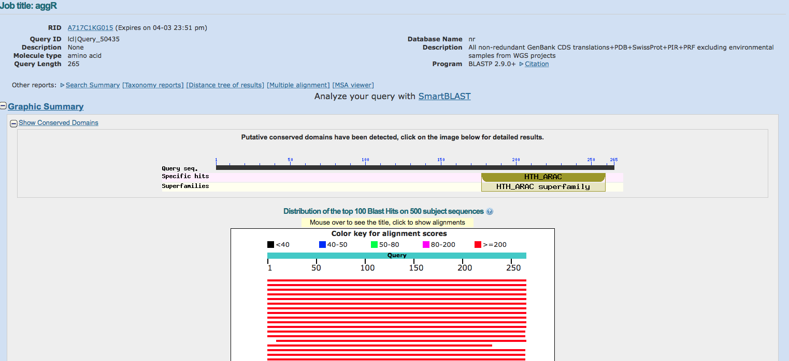
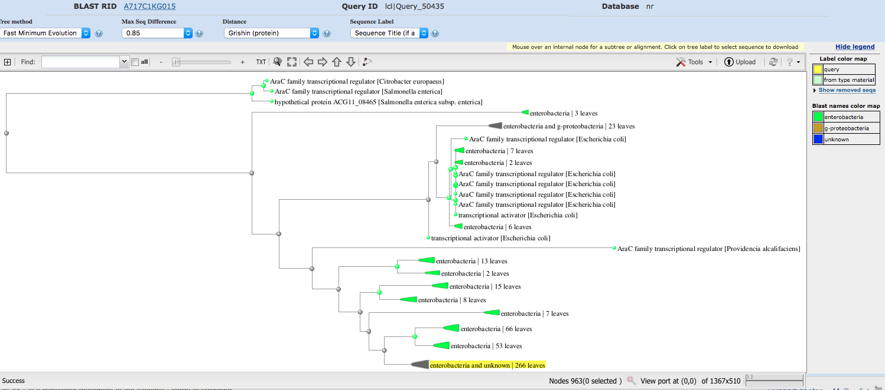

## Jennifer Stiens
j.j.stiens@gmail.com

[github.com/jenjane118/ngs_tutorials/coursework_2.md](https://github.com/jenjane118/ngs_tutorials)

##Question 1
$\color{blue}{\text{Compile a set of virulence-related genes in the AFPN02.1 strain and other E. coli strains}}$ $\color{blue}{\text{and compare them.}}$

First I went to the VFPB website (http://www.mgc.ac.cn/VFs/main.htm) and looked up 'virulence factors' associated with E. coli strains. The most common of these are: adherence, toxin, invasion, Type III translocated protein, and immune evasion. I can use these terms to annotate genes associated with virulence. 

[VFDB website, Escherichia Coli](http://www.mgc.ac.cn/cgi-bin/VFs/genus.cgi?Genus=Escherichia)
\
\
$\color{blue}{\text{a) Assemble a set of virulence-associated genes from public source or publication}}$
\ 
 
From VFDB I was able to download a database of DNA sequences of core set of experimentally-verified virulence-associated genes. This will be used to extract genes (and relevant sequences) for the associated adhesion genes for searching and annotating the AFPN02.1 genome. (VFDB_setA_nt.fas)
(http://www.mgc.ac.cn/VFs/download.htm) (Jin, *et.al.*, 2007). 

Using the information on the VFDB website (http://www.mgc.ac.cn/cgi-bin/VFs/genus.cgi?Genus=Escherichia), Brzuszkiewicz, *et. al.* (2011), and the spreadsheet of virulence genes from EHEC and EAEC strains from Cheung, *et.al*, (2011), I compiled a list of 18 pertinent virulence-related genes. There were many more genes available in the database, but these genes were selected because they are related to adhesion and toxin production. I used the gene names to select virulence-related genes from the VFDB.
\

\begin{center} Virulence genes (Brzuszkiewicz, et al, 2011) \end{center}
\
\
\
\

```bash
## help for this code came from (https://infoplatter.wordpress.com/2013/10/15/
## extracting-specific-fasta-records-from-a-multi-fasta-file/)
## grabs all ecoli files and sequences
awk 'BEGIN {RS=">"}/Escherichia/{print">"$0}' VFDB_setA_nt.fas \
> ecoli_vfdb_genes.fas
## grabs all files with these genes
cat ecoli_vfdb_genes.fas | awk \
'BEGIN {RS=">"}/aggR|agg3B|aat|astA|hlyA|sepA
|aggA|setA|espP|setC|aat|fimH|fimA|cpxA|cpxR|csgA|elfA|stx/ 
{print">"$0}' > virulence_vfdb_genes.fa
```

These have really elaborate headings, so I needed to make them much more simple:

```bash
## removes part of heading before gene name, replaces with '>'
cat virulence_vfdb_genes.fa | sed 's/^>.*(.*)\s(/>/g' > temp.fa
## removes rest of heading after gene name
cat temp.fa | sed 's/)\s.*$//g' > virulence_vfdb_editedgenes.fa
## remove extra blank lines between records
cat virulence_vfdb_editedgenes.fa | sed -e 's/^ *//; s/ *$//; /^$/d' \
> vfdb_virulence_genes.fa
```


$\color{blue}{\text{b) Build a separate set of virulence-associated genes in the annotation file created for AFPN02.1}}$

The next step is to work with the annotation.gff file to retrieve annotations based on 'virulence', 'adherence', 'toxin', and 'Type III' (short for Type III aggregative adherence fimbriae) and convert into .bed format.


```bash
cat annotation.gff | grep -E 'virulence|adherence|toxin|invasion|Type III' | 
awk 'BEGIN {FS="\t"}  split($9, captured, /[(=);]/) >=10  {print "sequence1" 
"\t" $4 "\t" $5 "\t" captured[10] "\t" captured[4] "\t" $7}'
> present_in_AFPN02_virulence_genes.bed
```
\


Then we have to retrieve the DNA sequence for these genes and save in fasta format:


```bash
/s/software/bedtools/v2.27.1/bin/bedtools getfasta -name -s -fi \
${st_path}/results_GC/annotation/genome.fna -bed \
present_in_AFPN02_virulence_genes.bed -fo present_in_AFPN02_virulence_genes.fasta
```

A bit more formatting to get rid of extra elements in the heading:


```bash
cat present_in_AFPN02_virulence_genes.fasta | sed 's/(.*//g' \
> present_in_AFRN02_virulence_genes.fasta
# to remove extra info in square brackets
cat present_in_AFPN02_virulence_genes.fasta | sed '/[.*]/d' > \
present_in_AFPN02_virulence_genes.fasta
# 
```


Then we have to combine the two files:

```bash
cat present_in_AFPN02_virulence_genes.fasta vfdb_virulence_genes.fa \
> final_comparison_virulence.fasta
cp present_in_AFPN02_virulence_genes.fasta vfdb_virulence_genes.fa \
final_comparison_virulence.fasta ${st_path}/results_GC/wholeGenomeExamples

```
\
\

$\color{blue}{\text{c) Use BRIG to visualise which of the virulence genes are present/absent in E. coli strains}}$

To run brig, use the following command:

```bash
/s/software/brig/BRIG-0.95-dist/brig.sh
```
\

\begin{center} BRIG: Blast Ring Image Generator (brig.sourceforge.net) \end{center}
\


Most of the virulence genes were present in AFPN02.1. However, hylA was only identified with a short sequence, aggA was completely missing, esp was mostly missing, though some parts were  present at lower identity, fimH was completely missing, stxA was more weakly identified, and agg3B was more weakly identified. The other shiga-toxin genes, stx2A/B were present in the AFPN02.1 strain, as well as in the sakai strain, which is a EHEC (enterohemmoraghic) strain, but isn't present at all in the other strains, except for short regions of identity with the other EHEC strain. The EHEC strain seemed the most different from the other strains, with only short regions of identity spread out over the genome, however, it seemed there were hits in all of the genes. 


## Question 2


$\color{blue}{\text{Select ONE of the virulence genes (or if you prefer one operon) present in AFPN02.1
and study}}$ $\color{blue}{\text{this gene/operon in more detail including its biological action/mechanism phylogeny.}}$

I have chosen to take a closer look at the gene *aggR*, 'aggregative regulator', a putative transcriptional activator that regulates many virulence factors including genes for adherence and toxin production (www.uniprot.org/uniprot/P43464). The *aggR* gene is part of a family of AraC transcriptional activators, regulatory proteins that bind DNA and control the expression of a whole host of other genes. The product of aggR is a DNA binding protein is aobut 30KDa in size, with a conserved helix-turn-helix motif (Navarro-Garcia, 2013).

AggR is called the 'master virulence regulator', as it regulates many other known virulence factors (Morin, 2013). Among the first of these identified are the genes encoding AAF, the aggregative adherence fimbriae. These proteins help the bacterium to adhere to the intestinal mucosa in a characteristic 'stacked-brick' pattern, which stimulates an inflammatory response in these cells, leading to diarrhea (Morin, et.al, 2013). The presence of AggR is essential for expression of AAF genes located on pAA plasmids. Another function is to regulate the expression and secretion of dispersin (by regulating aap and aat genes), another gene product involved in adherence to intestinal mucosa (Figure 1) (Sheikh, et al., 2001). In fact, microarray data has indicated that at least 44 genes are under the control of AggR, 23 of them on the bacterial chromosome, including many secretory proteins. 20 of these are found in what is called a 'pathogenicity island', a cluster of virulence genes that is obtained by a bacterium through horizontal gene transfer (Morin, 2013). 

\


\
\begin{center}Figure1. Map of aap-aggR loci from two E. coli strains producting AAF/II and AAF/I (Sheikh, 2001) \end{center}
\


To explore the phylogenetic origins of the aggR gene, I extracted the fasta sequence from the edited file of virulence genes I obtained from the Virulence Factor Database and ran a blast search.


```bash
cat vfdb_virulence_genes.fa | awk 'BEGIN {RS=">"}/aggR/{print">"$0}' > aggR.fa
```
I submitted this sequence to nBlast, using the nr/nt database, optimised for 'more dissimilar sequences'.
All of the hits were to E. coli, many to various plasmids that have been sequenced (Figure 2). It seems to be a gene found predominantly in enterobacteria, specifically, E. coli. The presence of AggR in the genome, is sometimes considered indicative of a 'typical EAEC' strain (Navarro-Garcia, 2013).


\

\
\begin{center}Figure 2. Phylogenetic tree showing evolutionary relationships of aggR gene among E. coli strains. \end{center}
\
I thought it might be interesting to see if there were any more interesting results using the protein sequence. I obtained the FASTA protein sequence from uniprot (https://www.uniprot.org/uniprot/P43464) 
```
>sp|P43464|AGGR_ECOLX Transcriptional activator AggR OS=Escherichia coli OX=562 GN=aggR PE=4 SV=1
MKLKQNIEKEIIKINNIRIHQYTVLYTSNCTIDVYTKEGSNTYLRNELIFLERGINISVR
LQKKKSTVNPFIAIRLSSDTLRRLKDALMIIYGISKVDACSCPNWSKGIIVADADDSVLD
TFKSIDHNDDSRITSDLIYLISKIENNRKIIESIYISAVSFFSDKVRNTIEKDLSKRWTL
AIIADEFNVSEITIRKRLESEYITFNQILMQSRMSKAALLLLDNSYQISQISNMIGFSST
SYFIRLFVKHFGITPKQFLTYFKSQ
```

and used it in a psi-blast query (https://blast.ncbi.nlm.nih.gov/Blast.cgi?PROGRAM=blastp&PAGE_TYPE=BlastSearch&BLAST_SPEC=&LINK_LOC=blasttab&LAST_PAGE=blastn) on a standard nr protein database. The results were slightly more interesting, showing that the protein is from the AraC family of transcriptional regulators and related to other genes involved with adhesion, such as the CFA/I fimbrial subunit D. The phylogenetic tree shows the relationship between this family of DNA-binding transcriptional regulators among bacteria, with AraC protein family members from Salmonella and Citrobacter as distant homologues (Figure 3).
\

\

\
\begin{center}Figure 3. Psi-blastp results and phylogenetic tree for AggR protein. \end{center}

## References

Brzuszkiewicz, E., Thürmer, A., Schuldes, J., Leimbach, A., Liesegang, H., Meyer, F.-D., … Daniel, R. (2011). Genome sequence analyses of two isolates from the recent Escherichia coli outbreak in Germany reveal the emergence of a new pathotype: Entero-Aggregative-Haemorrhagic Escherichia coli (EAHEC). Archives of Microbiology, 193(12), 883–891. https://doi.org/10.1007/s00203-011-0725-6

Cheung, M., Li, L., Nong, W., & Kwan, H. (2011). 2011 German Escherichia coli O104:H4 outbreak: Whole-genome phylogeny without alignment. BMC Research Notes, 4(December). https://doi.org/10.1186/1756-0500-4-533

Jin, Q., Sun, L., Yang, J., Chen, L., & Yu, J. (2007). VFDB 2008 release: an enhanced web-based resource for comparative pathogenomics. Nucleic Acids Research, 36(Database), D539–D542. https://doi.org/10.1093/nar/gkm951

Morin, N., Santiago, A. E., Ernst, R. K., Guillot, S. J., & Nataro, J. P. (2013). Characterization of the AggR regulon in enteroaggregative Escherichia coli. Infection and Immunity, 81(1), 122–132. https://doi.org/10.1128/IAI.00676-12

Navarro-Garcia, F. (2015). Escherichia coli O104:H4 Pathogenesis: an Enteroaggregative E. coli/Shiga Toxin-Producing E. coli Explosive Cocktail of High Virulence. Microbiology Spectrum, 2(6), 1–19. https://doi.org/10.1128/microbiolspec.ehec-0008-2013

Sheikh J, Czeczulin JR, Harrington S, et al. (2002). A novel dispersin protein in enteroaggregative Escherichia coli. J Clin Invest., 110(9), 1329–1337. doi:10.1172/JCI16172

The UniProt Consortium. UniProt: a worldwide hub of protein knowledge. 
Nucleic Acids Res. 47: D506-515 (2019). (www.uniprot.org/uniprot/P43464)
